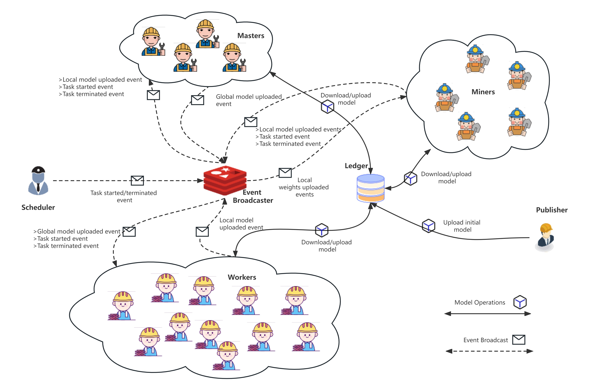

# FLSim Testbed

We build a flexible and efficient testbed, named FLSim, to simulate the workflow across all FL frameworks considered in [our paper](https://arxiv.org/abs/2301.04006), including the proposed IRONFORGE. We perform extensive experiments using FLSim to compare system performance, security, and fairness between existing FL frameworks and IRONFORGE. Insights are shed offer guidelines for selecting IRONFORGE strategies to fulfill various requirements.

The architecture of FLSim is as follows,



## Environment Setup

* Python

```
conda create -n flsim python=3.7.16
conda activate flsim
pip install -r requirements.txt
```

* Cluster information.

Replace the following hosts names with your owns. It is recommended to prepare at least 3 servers, each with 100 CPU cores and 300G memory, to ensure the reliable operation of the framework.

```
registry: docker.flsim.iovi.com
redis: redis.flsim.iovi.com
mysql: mysql.flsim.iovi.com-
fastdfs: 
 * dfs1.flsim.iovi.com
 * dfs2.flsim.iovi.com
runners: 
* svr1.flsim.iovi.com
* svr2.flsim.iovi.com
* svr11.flsim.iovi.com
* svr12.flsim.iovi.com
* svr13.flsim.iovi.com
* svr14.flsim.iovi.com
```

* Setup ssh-key

```
ssh-copy-id scj@redis.flsim.iovi.com
ssh-copy-id scj@mysql.flsim.iovi.com
ssh-copy-id scj@docker.flsim.iovi.com
ssh-copy-id scj@svr0.flsim.iovi.com
ssh-copy-id scj@svr1.flsim.iovi.com
ssh-copy-id scj@svr2.flsim.iovi.com
ssh-copy-id scj@dfs1.flsim.iovi.com
ssh-copy-id scj@dfs2.flsim.iovi.com
```

Add following code snippet to `~/.ssh/config`

```
Host redis.flsim.iovi.com
HostName redis.flsim.iovi.com
User scj
IdentityFile ~/.ssh/id_rsa4

Host mysql.flsim.iovi.com
HostName mysql.flsim.iovi.com
User scj
IdentityFile ~/.ssh/id_rsa4

Host docker.flsim.iovi.com
HostName docker.flsim.iovi.com
User scj
IdentityFile ~/.ssh/id_rsa4

Host svr0.flsim.iovi.com
HostName svr0.flsim.iovi.com
User scj
IdentityFile ~/.ssh/id_rsa4

Host svr1.flsim.iovi.com
HostName svr1.flsim.iovi.com
User scj
IdentityFile ~/.ssh/id_rsa4

Host svr2.flsim.iovi.com
HostName svr2.flsim.iovi.com
User scj
IdentityFile ~/.ssh/id_rsa4

Host dfs1.flsim.iovi.com
HostName dfs1.flsim.iovi.com
User scj
IdentityFile ~/.ssh/id_rsa4

Host dfs2.flsim.iovi.com
HostName dfs2.flsim.iovi.com
User scj
IdentityFile ~/.ssh/id_rsa4
```

* Deploy private docker repository

Used to pull and push flsim docker images.

```
sudo mkdir -p /data/flsim/docker/registry
sudo mkdir -p /data/flsim/docker/auth
sudo mkdir -p /data/flsim/certs/

sudo chmod -R 777 /data/flsim/

sudo docker run --entrypoint htpasswd registry:2.7.0 -Bbn flsim flsim > /data/flsim/docker/auth/htpasswd

sudo docker container run -d -p 5000:5000 --restart=always --name myRegistry02 --hostname=docker.flsim.iovi.com -v /data/flsim/docker/auth/:/auth -e "REGISTRY_AUTH=htpasswd" -e "REGISTRY_AUTH_HTPASSWD_REALM=Registry Realm" -e "REGISTRY_AUTH_HTPASSWD_PATH=/auth/htpasswd" -v /data/flsim/certs/:/certs -e REGISTRY_HTTP_TLS_CERTIFICATE=/certs/docker.flsim.iovi.com_bundle.crt -e REGISTRY_HTTP_TLS_KEY=/certs/docker.flsim.iovi.com.key registry:2.7.0 
```

* Setup redis

```
docker run -e TZ=Asia/Shanghai --name flsim-redis -p 0.0.0.0:6380:6379 -d redis
```

* Setup redis-cli

```
cd /tmp
wget http://download.redis.io/redis-stable.tar.gz
tar xvzf redis-stable.tar.gz
cd redis-stable
make
sudo cp src/redis-cli /usr/local/bin/
sudo chmod 755 /usr/local/bin/redis-cli
```

* Setup mysql

```
docker run -itd -e TZ=Asia/Shanghai --name flsim-mysql -p 0.0.0.0:3307:3306 --cpus=12 --memory="60G" -e MYSQL_ROOT_PASSWORD=flsim mysql
```

Configure parameters to increase database concurrency.

```
show variables like 'max_connections';
set global max_connections=13000;
set global innodb_thread_concurrency=16;
set global thread_cache_size=256;
set global innodb_flush_log_at_trx_commit=0;
set global innodb_autoextend_increment=1024;
set global innodb_log_buffer_size=160;
set global innodb_file_per_table=on;
set global innodb_io_capacity=40000;
set global innodb_io_capacity_max=40000;
```

* Setup mysql-client

```
sudo apt install mysql-client
mysql -uroot -p -hmysql.flsim.iovi.com -P3307
```

* Deploy the FastDFS Distributed File Storage System.

See `scripts/setup/install-fastdfs.sh`

## Database design

See `resoruces/flsim.sql`

## Experimental Procedure

* build fl runners as docker images

See `scripts/setup/build-docker-env.sh` and `scripts/setup/build-docker-node.sh`，where 'env' is used to build the fundamental runtime environment, and 'node' is used to instantiate task runner instances.

Scripts `scripts/runner/destroy-remote-runners.sh` and `scripts/runner/launch-remote-runners.sh` are used to batch destroy and create task runner instances.

* Initialize Database

```
bash scripts/setup/setup-db.sh
```

* Launch task scheduler

```
PYTHONPATH='./src' python scheduler.py 
```

* Batch creating runner instances

```
bash scripts/runner/launch-remote-runners.sh
```

* Start tasks

```
bash scripts/task/start-tasks.sh
```

## Other operations

* Destroy all runner instances

```
bash scripts/runner/destroy-remote-runners.sh
```

* Reset tasks

```
bash scripts/task/reset-tasks.sh
```

* Delete tasks

```
bash scripts/task/purge-tasks.sh
```

* Stop tasks

```
bash scripts/task/stop-tasks.sh
```

* Update tasks

```
bash scripts/task/update-tasks.sh
```

* Backup database

```
bash scripts/setup/backup-db.sh
```

* Check runner instances status

```
docker stats
```